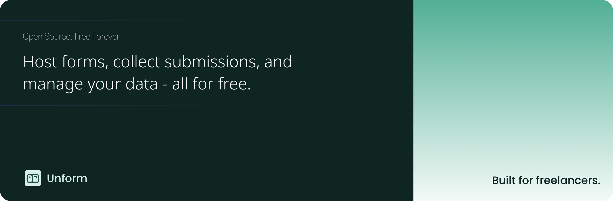

<div align="center">
  
  <h1>Unform</h1>
</div>



<br>

Unform is a simple, open-source alternative to Formspree. It allows you to create and manage forms without the need for a backend server. With Unform, you can easily collect form submissions, receive email notifications, and integrate with other services through webhooks.

## Features

- [x] Email notifications
- [x] Webhooks
- [x] Integrations
- [x] Access control
- [x] Form management
- [x] Submission tracking

## Prerequisites

Before you begin, ensure you have the following installed:

- Node.js (v16 or higher)
- Yarn package manager
- PostgreSQL database

## Getting Started

### 1. Clone the Repository

```bash
git clone https://github.com/unproducts/unform.git
cd unform
```

### 2. Environment Setup

Create a `.env` file in the root directory with the following variables:

```env
PORT=3000
NUXT_DB_HOST="localhost"
NUXT_DB_PORT="5432"
NUXT_DB_USER="postgres"
NUXT_DB_PASSWORD="postgres"
NUXT_DB_DATABASE="unform"
```

### 3. Install Dependencies

```bash
yarn install
```

### 4. Database Setup

Apply the database migrations:

```bash
yarn migration:apply
```

### 5. Start Development Server

```bash
yarn dev
```

The application will be available at `http://localhost:3000`

## Available Scripts

- `yarn dev` - Start development server
- `yarn build` - Build for production
- `yarn generate` - Generate static site
- `yarn preview` - Preview production build
- `yarn migration:generate` - Generate new migrations
- `yarn migration:apply` - Apply database migrations
- `yarn drizzle:update` - Update database schema

## Hosting Guide

### Self-Hosting

1. Set up a PostgreSQL database
2. Configure environment variables
3. Build the application:
   ```bash
   yarn build
   ```
4. Deploy the generated files to your hosting provider

### Docker Deployment

Coming soon...

## Contributing

We welcome contributions! Please follow these steps:

1. Fork the repository
2. Create a new branch
3. Make your changes
4. Submit a pull request

For bug reports or feature requests, please [open an issue](https://github.com/unproducts/unform/issues).

## Support

If you encounter any problems or have questions, please [Open an issue](https://github.com/unproducts/unform/issues)

Built with ❤️ by [@unproducts](https://github.com/unproducts)
